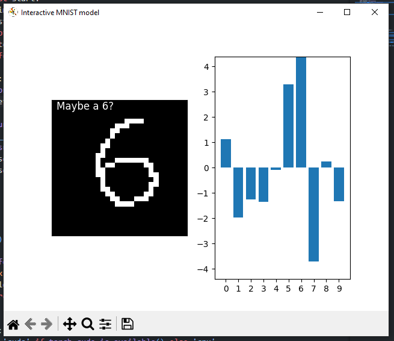

# MNIST training + interaction
I explored how to train a model to detect pixelated numbers using the publicly available MNIST dataset in order to learn a bit more about ML and torch. The process is laid out in the jupiter notebook.

## The interactive MNIST display
